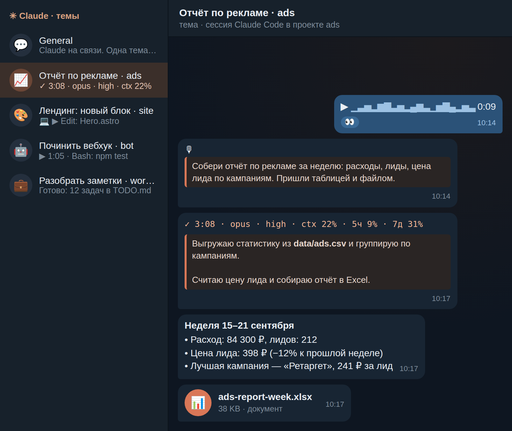
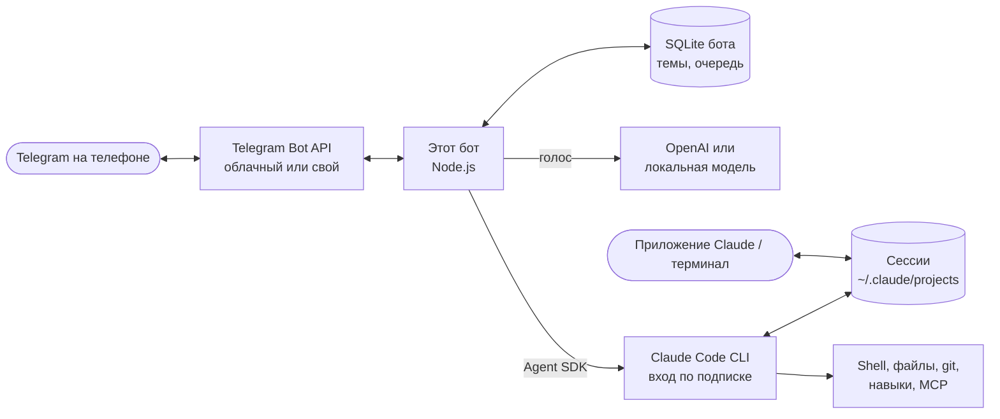

<div align="center">

# 🤖 Claude Telegram Bot

### Claude Code по твоей подписке — в Telegram: проекты, чаты, голосовые и файлы с телефона

**Пишешь или наговариваешь задачу в Telegram, Claude Code выполняет её у тебя на сервере или компьютере, а в ту же тему приходят ход работы, ответ и готовые файлы.**


[](https://github.com/artemmarketolog/claude-telegram-bot/actions/workflows/ci.yml)


<br>



</div>

---

> 🧑‍🎓 **Не хочешь ставить руками?** Отправь своему ИИ-агенту (Claude Code, Codex, Cursor) ссылку на этот репозиторий и напиши: **«Установи мне этого бота по INSTALL.md»**. Агент всё поставит и проверит сам, а тебя позовёт только за токеном бота, ключами и парой нажатий в Telegram.

## Что это

Telegram-интерфейс к [Claude Code](https://docs.claude.com/en/docs/claude-code/overview). Бот запускает **официальный Claude Code CLI на твоей машине, по твоей подписке Claude Pro или Max** — никаких API-ключей Anthropic и оплаты за токены. Личный чат с ботом превращается в рабочее место:

- **одна тема Telegram = один чат (сессия) Claude**, в общем чате — меню и новые задачи;
- чаты разложены **по проектам** (папкам);
- это **настоящие сессии Claude Code** с твоими `CLAUDE.md`, навыками, плагинами и хуками. Сессии из приложения Claude и терминала на этой машине видны в боте, их можно продолжить с телефона;
- работа идёт на машине, где стоит бот, поэтому на VPS она не прерывается, даже если телефон и ноутбук выключены.

## ✨ Возможности

- 💬 **Темы вместо хаоса.** Каждая задача — своя тема с названием «задача · проект» и иконкой проекта. После первого ответа тема получает короткое название (2–5 слов).
- 🎙 **Голосовые.** Наговариваешь задачу, бот расшифровывает её (OpenAI или бесплатная локальная модель) и отдаёт Claude. Расшифровка видна свёрнутой цитатой.
- 📎 **Файлы в обе стороны, до 2 ГБ.** Картинки Claude видит напрямую, остальное получает путём к файлу. Файлы, которые сделал Claude, приходят в тему: фото превью, видео плеером, остальное документом. Большие файлы — через свой Local Bot API, он ставится одним скриптом.
- 📊 **Живая карточка хода.** Время, модель, effort, заполненность контекста, текущее действие (`Bash: npm test · 0:37`), что Claude говорит по ходу работы, субагенты, фоновые задачи, лимиты подписки 5 ч / 7 дней и кнопка **■ Стоп**.
- ✍️ **Уточнения на лету.** Сообщение во время работы вклеивается в текущий ход. `/queue` ставит отдельную задачу в очередь.
- ❓ **Вопросы Claude — кнопками.** Когда Claude спрашивает (AskUserQuestion), варианты приходят кнопками, можно ответить и текстом.
- 🖥 **Сессии с компьютера.** Новый чат в приложении Claude на этой машине сам получает тему. `/sessions` — все сессии за 30 дней: открыл, и продолжаешь с телефона.
- 🔒 **Только владелец и только подписка.** Бот отвечает одному Telegram ID и отказывается работать, если Claude запустился не по подписке.

## 🏗 Как это устроено



Бот не хранит свою копию переписки: источник правды — транскрипты Claude Code в `~/.claude/projects`, общие с приложением и терминалом. Каждая сессия работает в одном процессе CLI, запущенном через [Claude Agent SDK](https://docs.claude.com/en/api/agent-sdk/overview) с тем же входом, настройками и навыками, что у тебя в терминале. Подробнее — в [docs/ARCHITECTURE.md](docs/ARCHITECTURE.md).

<details>
<summary>🧩 Простыми словами</summary>

<br>

| Слово | Что это | Аналогия |
| --- | --- | --- |
| **Claude Code** | ИИ-агент, который сам работает с файлами и командами | Сотрудник за компьютером |
| **Подписка Pro / Max** | Твой тариф claude.ai, по нему и работает бот | Абонемент вместо оплаты за каждый час |
| **Бот** | Мост между Telegram и Claude Code | Секретарь, который передаёт записки и отчёты |
| **Тема** | Отдельная ветка внутри чата с ботом | Папка для одного дела |
| **Threaded Mode** | Настройка бота в BotFather, которая включает темы | Разрешение завести папки |
| **VPS** | Арендованный сервер в интернете | Офис, который не закрывается на ночь |

</details>

## 🚀 Установка

**Проще всего через агента:** открой [INSTALL.md](INSTALL.md), там готовый промпт и пошаговый урок. Агент сам проверит окружение, поставит зависимости, запустит самопроверку и настроит автозапуск.

Руками — если Claude Code (с входом по подписке) и Node.js 22.13+ уже стоят:

```bash
git clone https://github.com/artemmarketolog/claude-telegram-bot.git
cd claude-telegram-bot
npm install
cp .env.example .env              # впиши токен бота и свой Telegram ID
npm run doctor                    # самопроверка: всё должно быть ✅
bash scripts/install-service.sh   # автозапуск (systemd на Linux, launchd на macOS)
```

Файлы больше 20 МБ: впиши в `.env` ключи с [my.telegram.org](https://my.telegram.org) и запусти `bash scripts/install-local-bot-api.sh` — бот начнёт принимать и отправлять файлы до 2000 МБ ([docs/LOCAL-BOT-API.md](docs/LOCAL-BOT-API.md)).

Перед этим в [@BotFather](https://t.me/BotFather) нужно создать бота и **включить темы в мини-приложении BotFather** (кнопка **Open** → My bots → бот → Bot Settings → Threads Settings → **Threaded Mode**). Командами в чате BotFather темы не включаются. Подробно — в [INSTALL.md](INSTALL.md#шаг-2-включи-темы-threaded-mode).

## 🎙 Голосовые: два варианта

| | Как | Цена | Качество и скорость |
| --- | --- | --- | --- |
| **OpenAI** (рекомендуется) | `OPENAI_API_KEY` в `.env`, модель `whisper-1` | $5 на балансе хватит на ~13 часов голосовых | Лучшее качество, несколько секунд на сообщение |
| **Локально, бесплатно** | `bash scripts/install-local-stt.sh` ставит NVIDIA Parakeet v3 через whisper.cpp | 0 ₽, работает без интернета | Русский и английский; зависит от процессора |

Ключ OpenAI нужен **только для расшифровки голоса**, Claude он не касается. Как получить ключ и пополнить баланс — в [docs/VOICE.md](docs/VOICE.md). Без обоих вариантов бот тоже работает: текст и файлы проходят, голосовое сохраняется оригиналом с пометкой.

## 📱 Команды

| Где | Команда | Что делает |
| --- | --- | --- |
| Общий чат | просто текст / голос / файл | Открывает новую тему в проекте по умолчанию и начинает работу |
| Общий чат | `/start`, `/new`, `/sessions` | Меню, новый чат в выбранном проекте, все сессии за 30 дней |
| Общий чат | `/model` | Модель и effort для новых чатов |
| Общий чат | `/stop` | Список идущих ходов с кнопками остановки |
| Тема | текст / голос / файл | Новый ход или уточнение идущего |
| Тема | `/stop`, кнопка **■ Стоп** | Остановить ход (и поставить очередь на паузу) |
| Тема | `/queue текст` | Отдельная задача в очередь этого чата |
| Тема | `/model`, `/context`, `/compact` | Модель чата, контекст и лимиты, сжатие |
| Тема | `/files`, `/archive` | Файлы чата, убрать тему (сессия останется на машине) |

Кнопка «сменить проект» под первым сообщением темы переносит задачу в другой проект.

## 🔒 Безопасность

- **Только подписка.** Бот не стартует, если в окружении есть `ANTHROPIC_API_KEY`, `ANTHROPIC_AUTH_TOKEN` или `CLAUDE_CODE_OAUTH_TOKEN`; процесс Claude получает чистое окружение и может войти только твоим входом `claude auth login`. Если Claude всё же запустился не по подписке, бот останавливает его.
- Claude работает **с полными правами твоего пользователя** (режим bypassPermissions, как «не спрашивать разрешений» в приложении). Поэтому доступ строго у одного `TELEGRAM_OWNER_ID` и только в личном чате; проверка владельца стоит до любых действий.
- Секреты лежат только в `.env` (права `600`, в `.gitignore`). Токены и ключи вырезаются из логов и сообщений; `.env`, `~/.claude/.credentials.json`, SSH-ключи и файлы с известными боту секретами в Telegram не отправляются.
- Включи в Telegram облачный пароль: кто владеет аккаунтом, тот управляет машиной.

Подробнее — в [SECURITY.md](SECURITY.md).

## ⚙️ Где что лежит

| Путь | Что |
| --- | --- |
| `.env` | Токен, твой ID, ключ OpenAI для голоса или путь к локальной модели |
| `projects.json` | Необязательный список проектов (пример: `projects.example.json`). Одна папка в списке — режим «одной главной папки»: бот не спрашивает проект, агент сам ходит по остальным папкам |
| `~/.claude-telegram/` | База бота и полученные файлы (`CLAUDE_TELEGRAM_DATA`) |
| `~/.claude/` | Сам Claude Code: вход, настройки, сессии |

## 📏 Ограничения

- Без своего сервера Telegram бот получает файлы **до 20 МБ** и отправляет **до 50 МБ**. Установка включает [Local Bot API](docs/LOCAL-BOT-API.md): с ним — до 2000 МБ в обе стороны.
- Сессии, начатые в боте, не появляются в приложении Claude: приложение показывает только свои сессии. Наоборот работает: начал в приложении — продолжай из Telegram.
- Одна сессия — один процесс. На Linux бот видит, что сессия открыта в приложении или терминале: простаивающий процесс он останавливает и продолжает сам, работающий не трогает (сообщение ждёт `✍`). На macOS такой проверки нет — не пиши из Telegram в сессию, которая прямо сейчас открыта на Mac.
- Если бот стоит на Mac, Mac должен быть включён и не спать. Для круглосуточной работы ставь на VPS.
- Уточнение во время хода попадает в работу на ближайшей границе инструментов, а не мгновенно.
- Ходы тратят лимиты твоей подписки так же, как работа в терминале.

## 🧪 Проверено

- `npm test`: 90 автоматических тестов с имитацией Claude и Telegram, включая нагрузочный на восемь чатов сразу. Гоняются в CI на каждый коммит.
- Чистая установка на Ubuntu 24.04 (Node.js 22, официальный установщик Claude Code): `npm ci`, тесты, `doctor` просит войти по подписке, запуск с `ANTHROPIC_API_KEY` отклоняется.
- Живой прогон с настоящим Claude Code по подписке и имитацией Telegram: `doctor`, тема из общего чата, карточка хода, ответ, файл пришёл документом, короткое название темы, голосовое через OpenAI и ответ в той же сессии, `/context`.

## 📄 Лицензия

[MIT](LICENSE). Это личный open-source проект, а не официальный продукт Anthropic или Telegram. Бот использует официальный Claude Code CLI и твою собственную подписку; соблюдай [условия использования Anthropic](https://www.anthropic.com/legal/consumer-terms).
